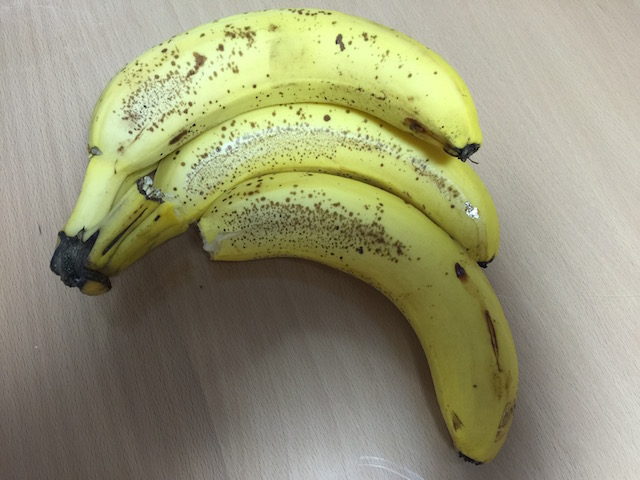

# deeplearning-learning
Study deeplearning

# Setup
## Install Chainer

### Mac
Install `pyenv` `anaconda-anaconda-2.4.0`.

Execute following command:
```sh
$ pip install chainer==1.8.1
```

### Linux
Install Ubuntu14.04.3

Execute following commands:
```sh
$ sudo apt-get update
$ sudo apt-get install python-pip python-dev
$ sudo pip install cython
$ sudo apt-get install libhdf5-dev
$ sudo pip install chainer==1.8.1
```

### Raspberry Pi
Install Raspbian Jessie.

Execute following commands:
```sh
$ sudo apt-get update
$ sudo apt-get install python-pip python-dev
$ sudo pip install cython
$ sudo apt-get install libhdf5-dev
$ sudo pip install chainer
```

## Download ImgeNet2012 image file name and label list
```sh
$ cd
$ git clone https://github.com/BVLC/caffe.git
$ cd caffe/data/ilsvrc12
$ ./get_ilsvrc_aux.sh 
```


## Import Caffe model
```sh
$ cd
$ git clone https://github.com/pfnet/chainer.git
$ cd chainer/examples/modelzoo
$ python download_model.py caffenet
$ python download_mean_file.py
```


# Test

## Clone this repository and setup
```sh
$ git clone https://github.com/karaage0703/deeplearning-learning
$ cd deeplearning-learning
```

```sh
$ cp ~/chainer/examples/modelzoo/ilsvrc_2012_mean.npy ./
$ cp ~/chainer/examples/modelzoo/bvlc_reference_caffenet.caffemodel ./
$ cp ~/caffe/data/ilsvrc12/synset_words.txt ./
```

## Run test
```sh
$ python evaluate_caffe_net_ranking.py cup.jpg caffenet bvlc_reference_caffenet.caffemodel -b ./
```

or

```sh
$ python evaluate_caffe_net_ranking.py banana.jpg caffenet bvlc_reference_caffenet.caffemodel -b ./
```


# Result

## Cup


```
1 | n07930864 cup | 46.7%
2 | n03063599 coffee mug | 46.3%
3 | n03775546 mixing bowl |  2.4%
4 | n07920052 espresso |  2.4%
5 | n04263257 soup bowl |  1.6%
```



```
1 | n07753592 banana | 78.8%
2 | n07716358 zucchini, courgette |  8.9%
3 | n03476684 hair slide |  1.4%
4 | n07718472 cucumber, cuke |  1.2%
5 | n01694178 African chameleon, Chamaeleo chamaeleon |  1.1%
```


# License
This software is released under the MIT License, see LICENSE.

# Authors
- karaage0703
- [shi3z](https://github.com/shi3z) (inspect_camera.py)
- [AtsushiSakai](https://github.com/AtsushiSakai) (translate.py)
- [SonyCSL](https://github.com/SonyCSL/CSLAIER) (examples/family_face_recognition)

# Reference
- https://github.com/shi3z/chainer_imagenet_tools
- https://github.com/AtsushiSakai/PythonTranslation
