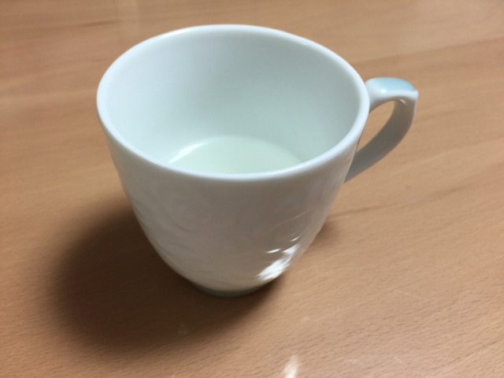

# deeplearning-learning
Study deeplearning

# Setup
## Install Chainer

Please see chainer website

## Download ImgeNet2012 image file name and label list
```sh
$ cd
$ git clone https://github.com/BVLC/caffe.git
$ cd caffe/data/ilsvrc12
$ ./get_ilsvrc_aux.sh 
```


## Import Caffe model
```sh
$ cd
$ git clone https://github.com/pfnet/chainer.git
$ cd chainer/examples/modelzoo
$ python download_model.py caffenet
$ python download_mean_file.py
```


# Test

## Clone this repository and setup
```sh
$ git clone https://github.com/karaage0703/deeplearning-learning
$ cd deeplearning-learning
```

```sh
$ cp ~/chainer/examples/modelzoo/ilsvrc_2012_mean.npy_20 ./
$ cp ~/chainer/examples/modelzoo/bvlc_reference_caffenet.caffemodel ./
$ cp ~/caffe/data/ilsvrc12/synset_words.txt ./
```

## Run test
```sh
$ python evaluate_caffe_net_ranking.py cup.jpg caffenet bvlc_reference_caffenet.caffemodel -b ./
```

or

```sh
$ python evaluate_caffe_net_ranking.py cup.jpg caffenet bvlc_reference_caffenet.caffemodel -b ./
```


# Result

## Cup


```
Loading Caffe model file bvlc_reference_caffenet.caffemodel...
Loaded
1 | n03063599 coffee mug | 59.7%
2 | n07930864 cup | 34.7%
3 | n07920052 espresso |  2.6%
4 | n04263257 soup bowl |  1.3%
5 | n03775546 mixing bowl |  1.2%
```


